# URL Shortener with Nginx Reverse Proxy

A containerized URL shortening service built with Node.js, Express, MongoDB, and Nginx as a reverse proxy. The application provides URL shortening and redirection functionality with visit tracking and health monitoring. This document outlines the system architecture, design decisions, deployment instructions, and testing procedures.

---

## Prologue

This project demonstrates a modern, containerized web application following microservices principles. It consists of three primary components:

- **Nginx** as a reverse proxy and load balancer.
- **Node.js/Express** application handling business logic and API endpoints.
- **MongoDB** for persistent storage of URL mappings and visit analytics.

The system is designed with scalability, observability, and reliability in mind. It includes health checks, structured logging, input validation, and persistent data volumes. The following sections detail the architecture, data flow, deployment steps, and testing strategies.

All diagrams in this document use a greyscale palette to maintain a professional, distraction‑free appearance while clearly conveying system interactions.

---

## Architecture

### System Overview

The diagram below illustrates the high-level interaction between components.

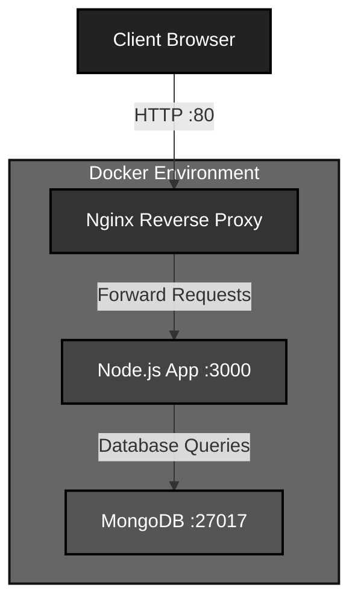

### Complete System Overview

A more detailed view includes the client layer, proxy layer, application layer, data layer, and infrastructure.

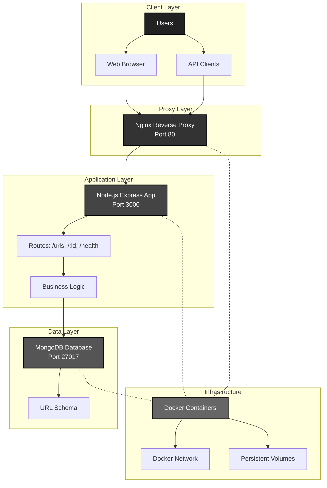

### Application Layer Architecture

Inside the Node.js application, the request flow follows a typical MVC pattern.

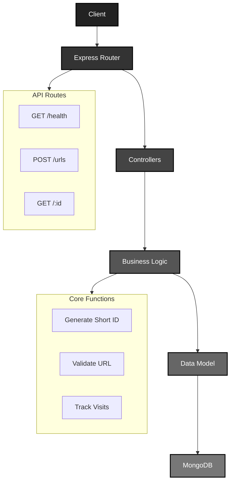

### Data Flow Overview

The data flows through three main operations: URL creation, redirection, and health checks.

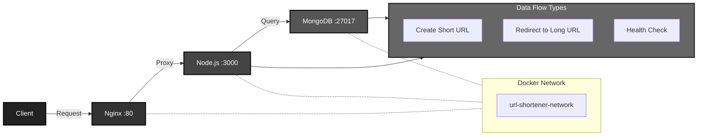

---

## Technology Stack

| Component       | Technology                | Role                                      |
|-----------------|---------------------------|-------------------------------------------|
| Proxy Layer     | Nginx                     | Reverse proxy, load balancing, SSL termination |
| Backend         | Node.js / Express         | Business logic, REST API                   |
| Database        | MongoDB                   | Persistent storage of URL mappings         |
| Containerization| Docker & Docker Compose   | Orchestration, isolation, portability      |
| Logging         | Winston                   | Structured JSON logs                        |
| Monitoring      | Docker Health Checks      | Container health verification               |

---

## Features

- **URL Shortening** – Generates 7‑character unique IDs (62⁷ possible combinations) for long URLs.
- **Redirection with Tracking** – 301 redirects to original URLs while incrementing a visit counter for analytics.
- **Nginx Reverse Proxy** – Handles incoming requests, forwards to the Node.js app, and can be extended for SSL and load balancing.
- **Container Orchestration** – Multi‑container setup with Docker Compose for easy deployment.
- **Health Monitoring** – Docker health checks and a `/health` endpoint to verify service availability.
- **Structured Logging** – Winston produces JSON logs suitable for aggregation tools (e.g., ELK stack).
- **Data Persistence** – MongoDB data stored in Docker volumes to survive container restarts.
- **Input Validation** – URL format validation and proper error responses.

---

## Quick Start

### Deployment Process

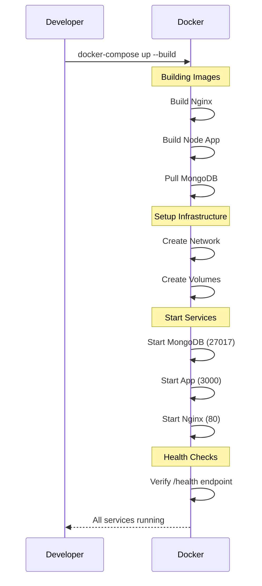

### Deployment State Management

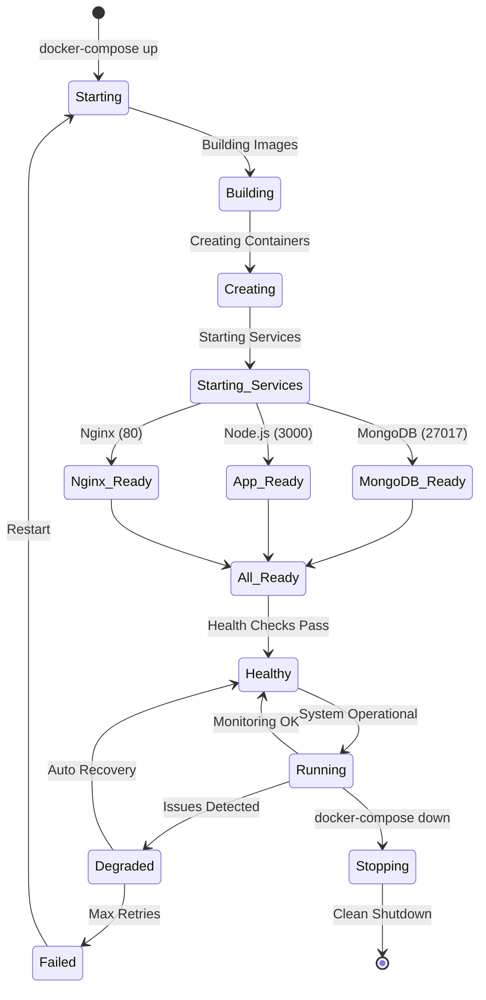

1. **Clone the repository**
   ```bash
   git clone https://github.com/Shahriarin2garden/url-shortener-lab02-feature-nginx-layer.git
   cd url-shortener-lab02-feature-nginx-layer
   ```

2. **Start all services**
   ```bash
   docker-compose up --build -d
   ```

3. **Verify services are running**
   ```bash
   docker-compose ps
   ```

4. **Test health endpoint**
   ```bash
   curl http://localhost/health
   ```

---

## API Endpoints

### Health Check
- **Endpoint**: `GET /health`
- **Response**: Service status, uptime, and timestamp
  ```json
  {
    "status": "healthy",
    "timestamp": "2025-08-28T10:30:00.000Z",
    "uptime": 120.45
  }
  ```

### Create Short URL
- **Endpoint**: `POST /urls`
- **Headers**: `Content-Type: application/json`
- **Body**: `{"longUrl": "https://example.com"}`
- **Response**: `{"shortUrl": "http://localhost/aBc123D"}`

### Redirect to Original URL
- **Endpoint**: `GET /:shortUrlId`
- **Response**: 301 redirect to original URL with visit counter increment

---

## API Workflows

### URL Creation Workflow

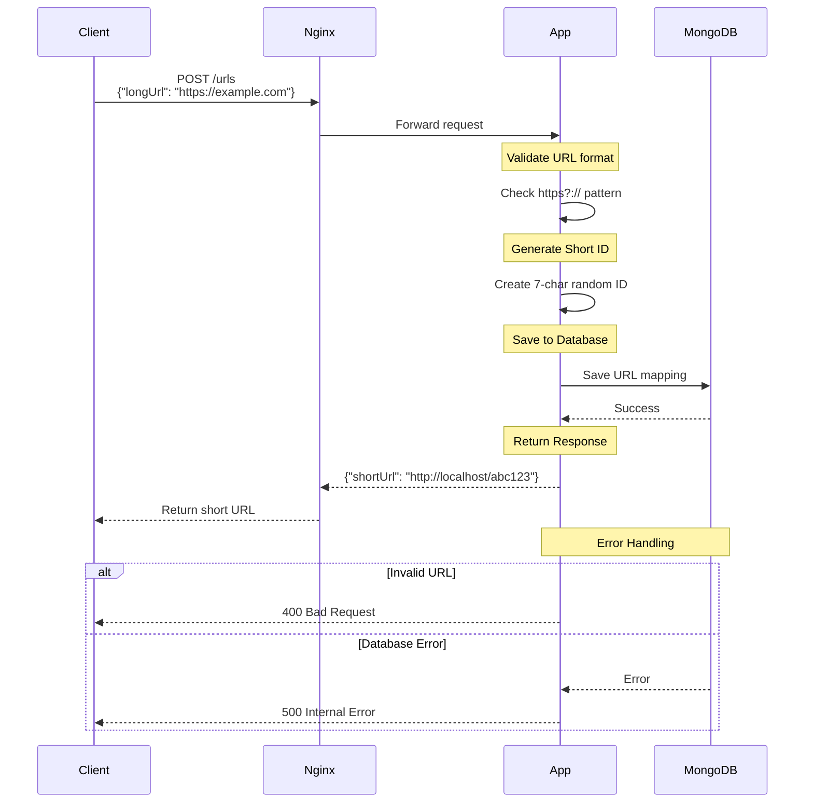

### URL Redirection Workflow

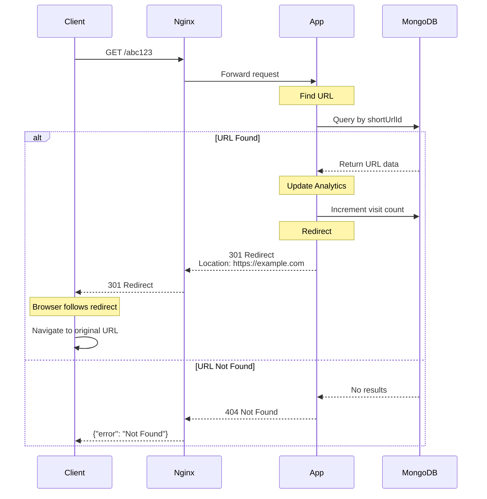

---

## Database Schema

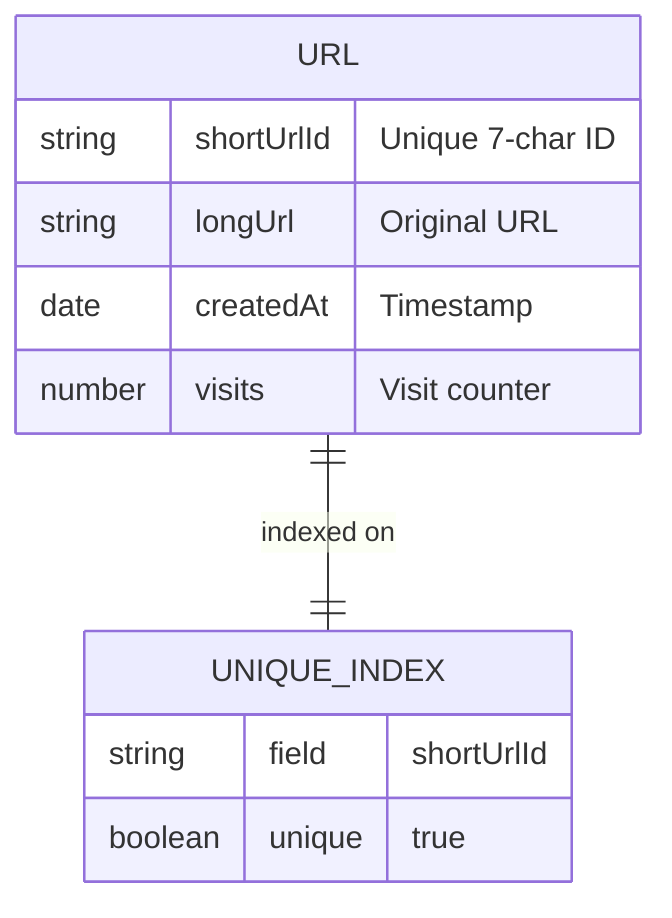

**Schema Details:**
```javascript
{
  shortUrlId: String,    // 7-character unique identifier (indexed)
  longUrl: String,       // Original URL (required, validated)
  createdAt: Date,       // Auto-generated timestamp
  visits: Number         // Visit counter (incremented on each redirect)
}
```

---

## Infrastructure

### Nginx Configuration

The Nginx server acts as a reverse proxy, forwarding all requests to the Node.js application.

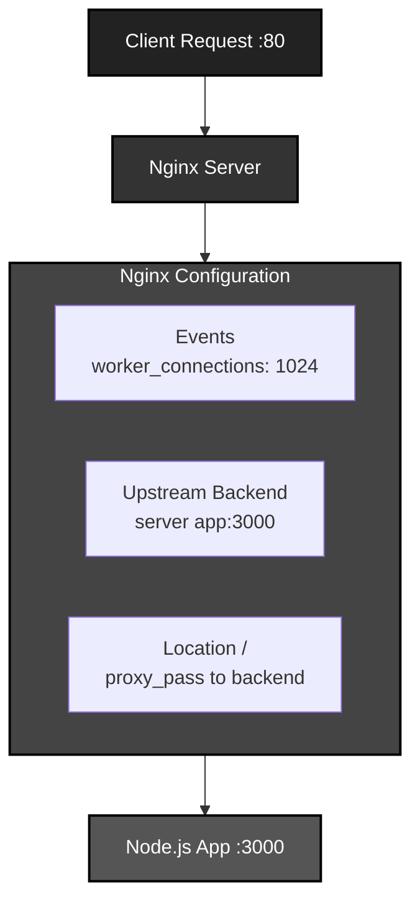

### Health Monitoring System

Docker executes periodic health checks against the application’s `/health` endpoint.

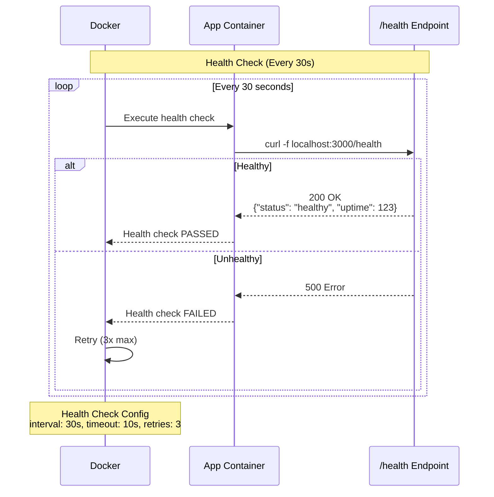

---

## Error Handling

The application implements consistent error handling across all endpoints.

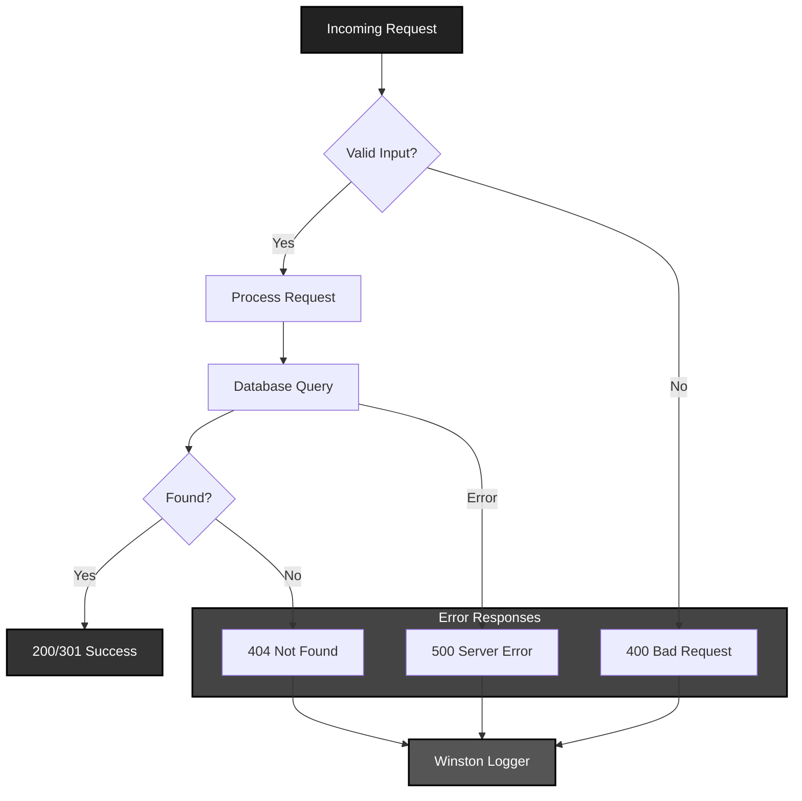

---

## Environment Variables

| Variable     | Description                         | Default                                  |
|--------------|-------------------------------------|------------------------------------------|
| `PORT`       | Application port                    | `3000`                                   |
| `MONGO_URI`  | MongoDB connection string           | `mongodb://mongodb:27017/url_shortener`  |
| `BASE_URL`   | Base URL for short links            | `http://localhost`                       |

---

## Testing

### Testing Workflow

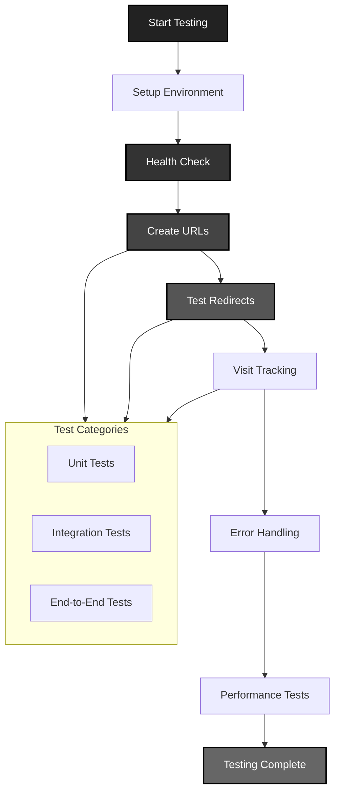

### Prerequisites for Testing

Before running tests, ensure the application is running:

```bash
# Start the application
docker-compose up --build -d

# Verify all containers are healthy
docker-compose ps
```

### 1. Health Check Testing

```bash
curl -X GET http://localhost/health
```

**Expected Response:**
```json
{
  "status": "healthy",
  "timestamp": "2025-08-28T10:30:00.123Z",
  "uptime": 45.67
}
```

### 2. URL Shortening Testing

```bash
curl -X POST http://localhost/urls \
  -H "Content-Type: application/json" \
  -d '{"longUrl": "https://www.google.com"}'
```

**Expected Response:**
```json
{
  "shortUrl": "http://localhost/aBc123D"
}
```

### 3. URL Redirection Testing

```bash
# Test redirect (will follow the redirect)
curl -L http://localhost/aBc123D

# Test redirect headers only
curl -I http://localhost/aBc123D
```

**Expected Redirect Response:**
```
HTTP/1.1 301 Moved Permanently
Location: https://www.google.com
```

### 4. Error Handling Testing

```bash
# Invalid URL
curl -X POST http://localhost/urls \
  -H "Content-Type: application/json" \
  -d '{"longUrl": "invalid-url"}'
```

**Expected Response:**
```json
{
  "error": "Invalid URL"
}
```

### 5. Container and Service Testing

```bash
# Check container logs
docker-compose logs app
```

### 6. Database Testing

```bash
# Connect to MongoDB container
docker exec -it url-shortener-mongodb-1 mongosh url_shortener

# MongoDB queries
db.urls.find()
```

### 7. Performance Testing (Basic)

```bash
# Concurrent URL creation
for i in {1..10}; do
  curl -X POST http://localhost/urls \
    -H "Content-Type: application/json" \
    -d "{\"longUrl\": \"https://example$i.com\"}" &
done
wait
```

### 8. End-to-End Testing Script

Create a script (`test.sh`) with the following content:

```bash
#!/bin/bash
echo "=== URL Shortener End-to-End Test ==="

echo "1. Testing Health Endpoint..."
curl -s http://localhost/health | jq .

echo -e "\n2. Creating Short URL..."
RESPONSE=$(curl -s -X POST http://localhost/urls \
  -H "Content-Type: application/json" \
  -d '{"longUrl": "https://www.github.com"}')
echo $RESPONSE

SHORT_URL=$(echo $RESPONSE | jq -r '.shortUrl')
SHORT_ID=$(echo $SHORT_URL | sed 's/.*\///')

echo -e "\n3. Testing Redirect..."
curl -I http://localhost/$SHORT_ID

echo -e "\nTest Complete!"
```

Run it:
```bash
chmod +x test.sh
./test.sh
```

### 9. Testing Checklist

- [ ] Health endpoint responds correctly
- [ ] Can create short URLs with valid long URLs
- [ ] Short URLs redirect to correct original URLs
- [ ] Visit counter increments correctly
- [ ] Invalid URLs are rejected with appropriate error
- [ ] Non-existent short URLs return 404
- [ ] All containers are running and healthy
- [ ] Database stores URL records correctly
- [ ] Nginx proxy forwards requests correctly
- [ ] Application logs are generated properly

---

## Troubleshooting

### Common Issues

1. **Port already in use**
   ```bash
   # Check what's using port 80
   lsof -i :80
   # Stop conflicting services or change ports in docker-compose.yml
   ```

2. **Container won't start**
   ```bash
   # Check logs for errors
   docker-compose logs app
   docker-compose logs nginx
   ```

3. **Database connection failed**
   ```bash
   # Verify MongoDB is running
   docker-compose ps mongodb
   # Check database logs
   docker-compose logs mongodb
   ```

4. **404 errors for all requests**
   ```bash
   # Check nginx configuration
   docker-compose exec nginx cat /etc/nginx/nginx.conf
   ```

---

## Development

### Running without Docker
```bash
# Install dependencies
npm install

# Set environment variables
export PORT=3000
export MONGO_URI=mongodb://localhost:27017/url_shortener
export BASE_URL=http://localhost:3000

# Start MongoDB (if not using Docker)
mongod

# Run application
npm start
# or for development with auto-reload
npm run dev
```

### Project Structure
```
url-shortener-lab02-feature-nginx-layer/
├── docker-compose.yml          # Container orchestration
├── Dockerfile                  # Application container build
├── package.json                # Node.js dependencies
├── nginx/
│   ├── Dockerfile              # Nginx container build
│   └── nginx.conf              # Nginx configuration
└── src/
    ├── app.js                  # Application entry point
    ├── config/index.js         # Environment configuration
    ├── controllers/urlController.js  # HTTP request handlers
    ├── models/urlModel.js       # Database schema
    ├── routes/urlRoutes.js      # API route definitions
    └── services/urlService.js   # Business logic
```

---

## License

ISC License
