# URL Shortener with Nginx Reverse Proxy

A containerized URL shortening service built with Node.js, Express, MongoDB, and Nginx as a reverse proxy. The application provides URL shortening and redirection functionality with visit tracking and health monitoring.

## Architecture

### System Overview

```mermaid
graph TD
    Client[🌐 Client Browser] -->|HTTP :80| Nginx[🔄 Nginx Proxy]
    Nginx -->|Forward| App[⚡ Node.js App :3000]
    App -->|Query| MongoDB[🗄️ MongoDB :27017]
    
    subgraph Docker[🐳 Docker Environment]
        Nginx
        App
        MongoDB
    end
    
    style Client fill:#e3f2fd,stroke:#1976d2,stroke-width:2px
    style Nginx fill:#f3e5f5,stroke:#7b1fa2,stroke-width:2px
    style App fill:#e8f5e8,stroke:#388e3c,stroke-width:2px
    style MongoDB fill:#fff3e0,stroke:#f57c00,stroke-width:2px
```

### Complete System Overview

```mermaid
graph TB
    subgraph "🌐 Client Layer"
        Users[👥 Users]
        Browser[🌐 Web Browser]
        API[📡 API Clients]
    end
    
    subgraph "🔄 Proxy Layer"
        Nginx[🔄 Nginx Reverse Proxy<br/>Port 80]
    end
    
    subgraph "⚡ Application Layer"
        App[⚡ Node.js Express App<br/>Port 3000]
        Routes[🛣️ Routes: /urls, /:id, /health]
        Logic[🧠 Business Logic]
    end
    
    subgraph "🗄️ Data Layer"
        MongoDB[🗄️ MongoDB Database<br/>Port 27017]
        Schema[📊 URL Schema]
    end
    
    subgraph "🐳 Infrastructure"
        Docker[🐳 Docker Containers]
        Network[🌐 Docker Network]
        Volumes[💾 Persistent Volumes]
    end
    
    Users --> Browser
    Users --> API
    Browser --> Nginx
    API --> Nginx
    
    Nginx --> App
    App --> Routes
    Routes --> Logic
    Logic --> MongoDB
    MongoDB --> Schema
    
    App -.- Docker
    Nginx -.- Docker
    MongoDB -.- Docker
    
    Docker --> Network
    Docker --> Volumes
    
    style Users fill:#e3f2fd,stroke:#1976d2
    style Nginx fill:#f3e5f5,stroke:#7b1fa2
    style App fill:#e8f5e8,stroke:#388e3c
    style MongoDB fill:#fff3e0,stroke:#f57c00
    style Docker fill:#ffebee,stroke:#d32f2f
```

### Application Layer Architecture

```mermaid
graph TD
    Client[🌐 Client] --> Router[🔀 Express Router]
    Router --> Controller[🎮 Controllers]
    Controller --> Service[⚙️ Business Logic]
    Service --> Model[📊 Data Model]
    Model --> DB[🗄️ MongoDB]
    
    subgraph Routes[📡 API Routes]
        HealthRoute[GET /health]
        CreateRoute[POST /urls]
        RedirectRoute[GET /:id]
    end
    
    subgraph Logic[🧠 Core Functions]
        Generate[Generate Short ID]
        Validate[Validate URL]
        Track[Track Visits]
    end
    
    Router --> Routes
    Service --> Logic
    
    style Client fill:#e3f2fd,stroke:#1976d2
    style Router fill:#f3e5f5,stroke:#7b1fa2
    style Controller fill:#e8f5e8,stroke:#388e3c
    style Service fill:#fff3e0,stroke:#f57c00
    style Model fill:#ffebee,stroke:#d32f2f
    style DB fill:#e0f2f1,stroke:#00695c
```

### Data Flow Overview

```mermaid
graph LR
    Client[🌐 Client] -->|Request| Nginx[🔄 Nginx :80]
    Nginx -->|Proxy| App[⚡ Node.js :3000]
    App -->|Query| MongoDB[🗄️ MongoDB :27017]
    
    subgraph Flow[📊 Data Flow Types]
        Create[➕ Create Short URL]
        Redirect[🔄 Redirect to Long URL]
        Health[🏥 Health Check]
    end
    
    subgraph Network[🌐 Docker Network]
        Bridge[url-shortener-network]
    end
    
    App --> Flow
    MongoDB --> Flow
    
    Nginx -.- Network
    App -.- Network
    MongoDB -.- Network
    
    style Client fill:#e3f2fd,stroke:#1976d2
    style Nginx fill:#f3e5f5,stroke:#7b1fa2
    style App fill:#e8f5e8,stroke:#388e3c
    style MongoDB fill:#fff3e0,stroke:#f57c00
    style Flow fill:#ffebee,stroke:#d32f2f
```

## Technology Stack

- **Frontend Layer**: Nginx (reverse proxy)
- **Backend**: Node.js with Express.js
- **Database**: MongoDB
- **Containerization**: Docker & Docker Compose
- **Logging**: Winston (structured JSON logs)

## Features

- ✅ **URL Shortening**: Generate 7-character unique IDs (62^7 combinations)
- ✅ **URL Redirection**: 301 redirects with visit tracking analytics
- ✅ **Nginx Reverse Proxy**: Load balancing and request forwarding
- ✅ **Container Orchestration**: Multi-container Docker setup
- ✅ **Health Monitoring**: Container health checks and `/health` endpoint
- ✅ **Structured Logging**: JSON formatted logs with Winston
- ✅ **Data Persistence**: MongoDB with persistent volumes
- ✅ **Input Validation**: URL format validation and error handling

## Quick Start

### Deployment Process

```mermaid
sequenceDiagram
    participant Dev as 👨‍💻 Developer
    participant Docker as 🐳 Docker
    
    Dev->>Docker: docker-compose up --build
    
    Note over Docker: 📦 Building Images
    Docker->>Docker: Build Nginx
    Docker->>Docker: Build Node App
    Docker->>Docker: Pull MongoDB
    
    Note over Docker: 🌐 Setup Infrastructure
    Docker->>Docker: Create Network
    Docker->>Docker: Create Volumes
    
    Note over Docker: 🚀 Start Services
    Docker->>Docker: Start MongoDB (27017)
    Docker->>Docker: Start App (3000)
    Docker->>Docker: Start Nginx (80)
    
    Note over Docker: ✅ Health Checks
    Docker->>Docker: Verify /health endpoint
    
    Docker-->>Dev: ✅ All services running!
```

### Deployment State Management

```mermaid
stateDiagram-v2
    [*] --> Starting : 🚀 docker-compose up
    
    Starting --> Building : 🔨 Building Images
    Building --> Creating : 📦 Creating Containers
    Creating --> Starting_Services : ⚡ Starting Services
    
    Starting_Services --> MongoDB_Ready : 🗄️ MongoDB (27017)
    Starting_Services --> App_Ready : ⚡ Node.js (3000)
    Starting_Services --> Nginx_Ready : 🔄 Nginx (80)
    
    MongoDB_Ready --> All_Ready
    App_Ready --> All_Ready
    Nginx_Ready --> All_Ready
    
    All_Ready --> Healthy : ✅ Health Checks Pass
    
    Healthy --> Running : 🟢 System Operational
    
    Running --> Healthy : 🔄 Monitoring OK
    Running --> Degraded : ⚠️ Issues Detected
    
    Degraded --> Healthy : 🔧 Auto Recovery
    Degraded --> Failed : ❌ Max Retries
    
    Failed --> Starting : 🔄 Restart
    
    Running --> Stopping : 🛑 docker-compose down
    Stopping --> [*] : ✅ Clean Shutdown
```

1. **Clone the repository**
```bash
git clone https://github.com/Shahriarin2garden/url-shortener-lab02-feature-nginx-layer.git
cd url-shortener-lab02-feature-nginx-layer
```

2. **Start all services**
```bash
docker-compose up --build -d
```

3. **Verify services are running**
```bash
docker-compose ps
```

4. **Test health endpoint**
```bash
curl http://localhost/health
```

## API Endpoints

### Health Check
- **Endpoint**: `GET /health`
- **Response**: Service status, uptime, and timestamp
```json
{
  "status": "healthy",
  "timestamp": "2025-08-28T10:30:00.000Z",
  "uptime": 120.45
}
```

### Create Short URL
- **Endpoint**: `POST /urls`
- **Headers**: `Content-Type: application/json`
- **Body**: `{"longUrl": "https://example.com"}`
- **Response**: `{"shortUrl": "http://localhost/aBc123D"}`

### Redirect to Original URL
- **Endpoint**: `GET /:shortUrlId`
- **Response**: 301 redirect to original URL + visit counter increment

## API Workflows

### URL Creation Workflow

```mermaid
sequenceDiagram
    participant C as 🌐 Client
    participant N as 🔄 Nginx
    participant A as ⚡ App
    participant DB as 🗄️ MongoDB
    
    C->>N: POST /urls<br/>{"longUrl": "https://example.com"}
    N->>A: Forward request
    
    Note over A: ✅ Validate URL format
    A->>A: Check https?:// pattern
    
    Note over A: 🎲 Generate Short ID
    A->>A: Create 7-char random ID
    
    Note over A: 💾 Save to Database
    A->>DB: Save URL mapping
    DB-->>A: Success ✅
    
    Note over A: 📤 Return Response
    A-->>N: {"shortUrl": "http://localhost/abc123"}
    N-->>C: Return short URL
    
    Note over A,DB: ❌ Error Handling
    alt Invalid URL
        A-->>C: 400 Bad Request
    else Database Error
        DB-->>A: Error
        A-->>C: 500 Internal Error
    end
```

### URL Redirection Workflow

```mermaid
sequenceDiagram
    participant C as 🌐 Client
    participant N as 🔄 Nginx
    participant A as ⚡ App
    participant DB as 🗄️ MongoDB
    
    C->>N: GET /abc123
    N->>A: Forward request
    
    Note over A: 🔍 Find URL
    A->>DB: Query by shortUrlId
    
    alt URL Found ✅
        DB-->>A: Return URL data
        
        Note over A: 📊 Update Analytics
        A->>DB: Increment visit count
        
        Note over A: ↩️ Redirect
        A-->>N: 301 Redirect<br/>Location: https://example.com
        N-->>C: 301 Redirect
        
        Note over C: 🌐 Browser follows redirect
        C->>C: Navigate to original URL
        
    else URL Not Found ❌
        DB-->>A: No results
        A-->>N: 404 Not Found
        N-->>C: {"error": "Not Found"}
    end
```

## Database Schema

```mermaid
erDiagram
    URL {
        string shortUrlId "🔑 Unique 7-char ID"
        string longUrl "🌐 Original URL"
        date createdAt "📅 Timestamp"
        number visits "📊 Visit counter"
    }
    
    URL ||--|| UNIQUE_INDEX : "indexed on"
    
    UNIQUE_INDEX {
        string field "shortUrlId"
        boolean unique "true"
    }
```

**Schema Details:**
```javascript
{
  shortUrlId: String,    // 7-character unique identifier (indexed)
  longUrl: String,       // Original URL (required, validated)
  createdAt: Date,       // Auto-generated timestamp
  visits: Number         // Visit counter (incremented on each redirect)
}
```

## Infrastructure

### Nginx Configuration

```mermaid
graph TD
    Client[🌐 Client Request :80] --> Nginx[🔄 Nginx Server]
    
    subgraph Config[⚙️ Nginx Configuration]
        Events[📊 Events<br/>worker_connections: 1024]
        Upstream[🎯 Upstream Backend<br/>server app:3000]
        Location[📍 Location /<br/>proxy_pass to backend]
    end
    
    Nginx --> Config
    Config --> App[⚡ Node.js App :3000]
    
    style Client fill:#e3f2fd,stroke:#1976d2
    style Nginx fill:#f3e5f5,stroke:#7b1fa2
    style Config fill:#fff3e0,stroke:#f57c00
    style App fill:#e8f5e8,stroke:#388e3c
```

### Health Monitoring System

```mermaid
sequenceDiagram
    participant Docker as 🐳 Docker
    participant App as ⚡ App Container
    participant Health as 🏥 /health Endpoint
    
    Note over Docker,Health: 🔄 Health Check (Every 30s)
    
    loop Every 30 seconds
        Docker->>App: Execute health check
        App->>Health: curl -f localhost:3000/health
        
        alt Healthy ✅
            Health-->>App: 200 OK<br/>{"status": "healthy", "uptime": 123}
            App-->>Docker: Health check PASSED
        else Unhealthy ❌
            Health-->>App: 500 Error
            App-->>Docker: Health check FAILED
            Docker->>Docker: Retry (3x max)
        end
    end
    
    Note over Docker: 🔧 Health Check Config<br/>interval: 30s, timeout: 10s, retries: 3
```

## Error Handling

```mermaid
graph TD
    Request[📥 Incoming Request] --> Validate{✅ Valid Input?}
    
    Validate -->|Yes| Process[⚡ Process Request]
    Validate -->|No| BadRequest[❌ 400 Bad Request]
    
    Process --> Database[🗄️ Database Query]
    Database --> Found{🔍 Found?}
    
    Found -->|Yes| Success[✅ 200/301 Success]
    Found -->|No| NotFound[🔍 404 Not Found]
    
    Database -->|Error| ServerError[⚠️ 500 Server Error]
    
    subgraph Errors[🚨 Error Responses]
        BadRequest
        NotFound
        ServerError
    end
    
    BadRequest --> Logger[📝 Winston Logger]
    NotFound --> Logger
    ServerError --> Logger
    
    style Request fill:#e3f2fd,stroke:#1976d2
    style Success fill:#e8f5e8,stroke:#388e3c
    style Errors fill:#ffebee,stroke:#d32f2f
    style Logger fill:#fff3e0,stroke:#f57c00
```

## Environment Variables

| Variable | Description | Default |
|----------|-------------|---------|
| `PORT` | Application port | `3000` |
| `MONGO_URI` | MongoDB connection string | `mongodb://mongodb:27017/url_shortener` |
| `BASE_URL` | Base URL for short links | `http://localhost` |

## Testing

### Testing Workflow

```mermaid
graph TD
    Start[🚀 Start Testing] --> Setup[⚙️ Setup Environment]
    Setup --> Health[🏥 Health Check]
    
    Health --> Create[➕ Create URLs]
    Create --> Redirect[🔄 Test Redirects]
    Redirect --> Analytics[📊 Visit Tracking]
    
    Analytics --> Errors[⚠️ Error Handling]
    Errors --> Performance[⚡ Performance Tests]
    Performance --> Complete[✅ Testing Complete]
    
    subgraph Tests[🧪 Test Categories]
        Unit[Unit Tests]
        Integration[Integration Tests]
        E2E[End-to-End Tests]
    end
    
    Create --> Tests
    Redirect --> Tests
    Analytics --> Tests
    
    style Start fill:#e3f2fd,stroke:#1976d2
    style Health fill:#e8f5e8,stroke:#388e3c
    style Create fill:#fff3e0,stroke:#f57c00
    style Redirect fill:#f3e5f5,stroke:#7b1fa2
    style Complete fill:#e0f2f1,stroke:#00695c
```

### Prerequisites for Testing

Before running tests, ensure the application is running:

```bash
# Start the application
docker-compose up --build -d

# Verify all containers are healthy
docker-compose ps
```

### 1. Health Check Testing

#### Test the Health Endpoint
```bash
curl -X GET http://localhost/health
```

**Expected Response:**
```json
{
  "status": "healthy",
  "timestamp": "2025-08-28T10:30:00.123Z",
  "uptime": 45.67
}
```

### 2. URL Shortening Testing

#### Create a Short URL
```bash
curl -X POST http://localhost/urls \
  -H "Content-Type: application/json" \
  -d '{"longUrl": "https://www.google.com"}'
```

**Expected Response:**
```json
{
  "shortUrl": "http://localhost/aBc123D"
}
```

#### Test Multiple URL Creation
```bash
# Create multiple short URLs
curl -X POST http://localhost/urls -H "Content-Type: application/json" -d '{"longUrl": "https://github.com"}'
curl -X POST http://localhost/urls -H "Content-Type: application/json" -d '{"longUrl": "https://stackoverflow.com"}'
curl -X POST http://localhost/urls -H "Content-Type: application/json" -d '{"longUrl": "https://youtube.com"}'
```

### 3. URL Redirection Testing

#### Test Redirect Functionality
```bash
# Test redirect (will follow the redirect)
curl -L http://localhost/aBc123D

# Test redirect headers only (see the redirect response)
curl -I http://localhost/aBc123D
```

**Expected Redirect Response:**
```
HTTP/1.1 301 Moved Permanently
Location: https://www.google.com
```

#### Test Visit Counter
```bash
# Make multiple requests to increment visit counter
curl -I http://localhost/aBc123D
curl -I http://localhost/aBc123D
curl -I http://localhost/aBc123D
```

### 4. Error Handling Testing

#### Test Invalid URL Format
```bash
curl -X POST http://localhost/urls \
  -H "Content-Type: application/json" \
  -d '{"longUrl": "invalid-url"}'
```

**Expected Response:**
```json
{
  "error": "Invalid URL"
}
```

#### Test Missing URL Parameter
```bash
curl -X POST http://localhost/urls \
  -H "Content-Type: application/json" \
  -d '{}'
```

#### Test Non-existent Short URL
```bash
curl -I http://localhost/nonexistent
```

**Expected Response:**
```json
{
  "error": "Not Found"
}
```

### 5. Container and Service Testing

#### Test Container Status
```bash
# Check all container status
docker-compose ps

# Check container logs
docker-compose logs nginx
docker-compose logs app
docker-compose logs mongodb
```

#### Test Network Connectivity
```bash
# Test internal container communication
docker exec url-shortener-app-1 wget -O- http://mongodb:27017
docker exec url-shortener-nginx-1 wget -O- http://app:3000/health
```

### 6. Database Testing

#### Connect to MongoDB and Verify Data
```bash
# Connect to MongoDB container
docker exec -it url-shortener-mongodb-1 mongosh url_shortener

# MongoDB queries to test
db.urls.find()
db.urls.countDocuments()
db.urls.find({}, {shortUrlId: 1, longUrl: 1, visits: 1, _id: 0})
```

### 7. Performance Testing

#### Basic Load Testing with curl
```bash
# Test concurrent requests
for i in {1..10}; do
  curl -X POST http://localhost/urls \
    -H "Content-Type: application/json" \
    -d "{\"longUrl\": \"https://example$i.com\"}" &
done
wait
```

#### Stress Test Redirects
```bash
# Stress test redirections (replace aBc123D with actual short URL)
for i in {1..50}; do
  curl -s -o /dev/null -w "%{http_code}\n" http://localhost/aBc123D &
done
wait
```

### 8. End-to-End Testing Script

Create a comprehensive test script:

```bash
#!/bin/bash
echo "=== URL Shortener End-to-End Test ==="

echo "1. Testing Health Endpoint..."
curl -s http://localhost/health | jq .

echo -e "\n2. Creating Short URL..."
RESPONSE=$(curl -s -X POST http://localhost/urls \
  -H "Content-Type: application/json" \
  -d '{"longUrl": "https://www.github.com"}')
echo $RESPONSE

SHORT_URL=$(echo $RESPONSE | jq -r '.shortUrl')
SHORT_ID=$(echo $SHORT_URL | sed 's/.*\///')

echo -e "\n3. Testing Redirect..."
curl -I http://localhost/$SHORT_ID

echo -e "\n4. Testing Multiple Visits..."
for i in {1..3}; do
  echo "Visit $i:"
  curl -s -I http://localhost/$SHORT_ID | grep "HTTP\|Location"
done

echo -e "\n5. Testing Error Cases..."
curl -s -X POST http://localhost/urls \
  -H "Content-Type: application/json" \
  -d '{"longUrl": "invalid"}' | jq .

echo -e "\nTest Complete!"
```

### 9. Testing Checklist

Use this checklist to verify all functionality:

- [ ] Health endpoint responds correctly
- [ ] Can create short URLs with valid long URLs
- [ ] Short URLs redirect to correct original URLs
- [ ] Visit counter increments correctly
- [ ] Invalid URLs are rejected with appropriate error
- [ ] Non-existent short URLs return 404
- [ ] All containers are running and healthy
- [ ] Database stores URL records correctly
- [ ] Nginx proxy forwards requests correctly
- [ ] Application logs are generated properly

## Troubleshooting

### Common Issues

1. **Port already in use**
   ```bash
   # Check what's using port 80
   lsof -i :80
   # Stop conflicting services or change ports
   ```

2. **Container won't start**
   ```bash
   # Check logs for errors
   docker-compose logs app
   docker-compose logs nginx
   ```

3. **Database connection failed**
   ```bash
   # Verify MongoDB is running
   docker-compose ps mongodb
   # Check database logs
   docker-compose logs mongodb
   ```

4. **404 errors for all requests**
   ```bash
   # Check nginx configuration
   docker-compose exec nginx cat /etc/nginx/nginx.conf
   ```

## Development

### Running without Docker
```bash
# Install dependencies
npm install

# Set environment variables
export PORT=3000
export MONGO_URI=mongodb://localhost:27017/url_shortener
export BASE_URL=http://localhost:3000

# Start MongoDB (if not using Docker)
mongod

# Run application
npm start
# or for development with auto-reload
npm run dev
```

### Project Structure
```
url-shortener-lab02-feature-nginx-layer/
├── docker-compose.yml          # Container orchestration
├── Dockerfile                  # Application container build
├── package.json               # Node.js dependencies
├── nginx/
│   ├── Dockerfile            # Nginx container build
│   └── nginx.conf            # Nginx configuration
└── src/
    ├── app.js                # Application entry point
    ├── config/index.js       # Environment configuration
    ├── controllers/urlController.js  # HTTP request handlers
    ├── models/urlModel.js    # Database schema
    ├── routes/urlRoutes.js   # API route definitions
    └── services/urlService.js # Business logic
```

## License

ISC License